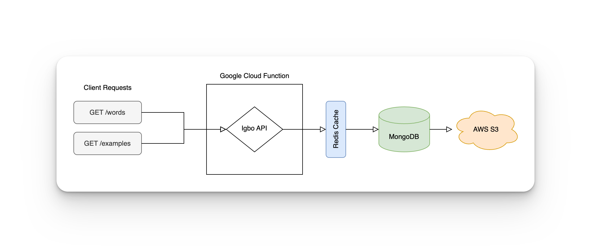

import React from 'react';

# The Igbo API

Welcome to the Igbo API documentation 👋🏾 The Igbo API is an open-source API that provides access to Igbo words, audio pronunciations, and sentences that powers the future of Igbo technology.

## Features 

📚 4,500+ Igbo words, 17,000+ dialectal variations, 18,000+ Igbo example sentences

✍🏾 English and Igbo definitions

🗣 Audio pronunciations for words and examples

🔎 Full-text search with diacritic support

🚀 and so much more

## Want a Demo?

Visit our website for a [demo](https://igboapi.com/#try-it-out) 🧱

## What do you get from the Igbo API?

The Igbo API enables you to:

* Search for Igbo words and fully translated example sentences
* Get audio pronunciations for words and sentences
* Proverbs are available
* Related terms and word stems
* Dialectal variations
* Nsịbịdị for words and example sentences
* Spelling variations for words

## Who should use Igbo API?

The Igbo API is an open-source project that enables developers, researchers, and others 
to build products, prototypes, or demos that rely on Igbo data. If you fit into any aspect 
of that description, this API is for you.

## Are there limits?

We believe this technology should be incredibly accessible. All developers have a daily limit of 
2,500 requests.

If you start to pass that daily limit, we'll reach out to see how we can increase you usage limit.

## Under the hood

The Igbo API source code available on GitHub is deployed to a Google Cloud Function that directly connects to 
Redis for caching, MongoDB for our word and example text data, and AWS S3 for our audio files.

